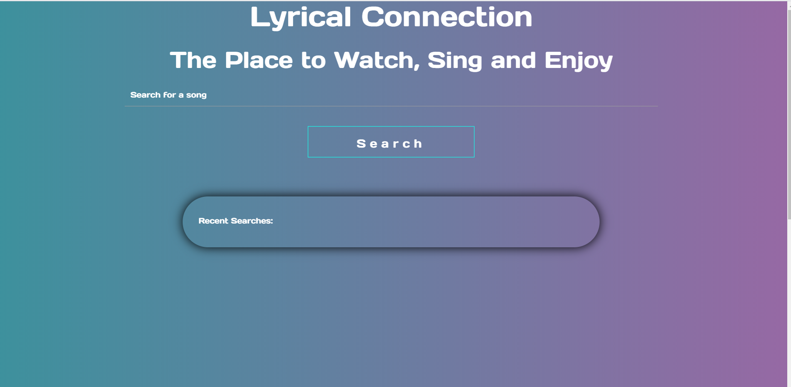
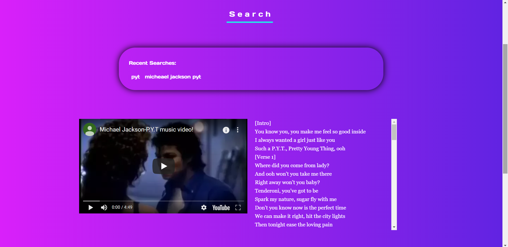
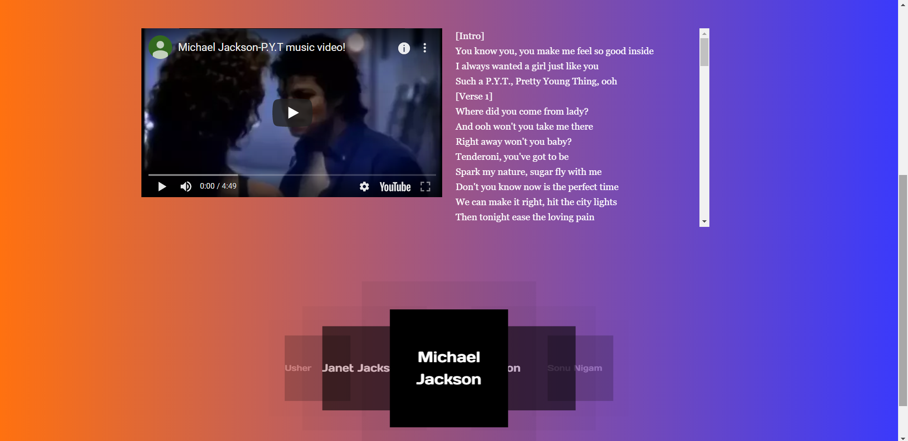

## project-1 -- 
Pulling information about the song you're listening to while you're listening to it. Getting lyrics for a song you're listening to. Display upcoming events related to the artist playing. Display suggested music.

## Sketch

## Example of Website feartures
This is an image of the homepage:

This is an image of the music video and lyrics the user inputed thatwas retrieved from the API:

This is an image of Recommened the artist searches:

## API's used
Genius
YouTube
SongKick
TasteDive

## Tasks
1. Create the design of the project
2. Inspect API's and embed YouTube onto the website
3. Build logic to display searched song using AJAX
4. Build logic to manipulate the information pulled from YouTube to connect with Genius
5. Build logic to display event information
6. Troubleshoot 

